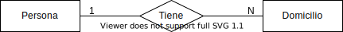

# Taller: Diseño e implementación de una base de datos relacional
## Parte 1

En este taller, vamos a diseñar e implementar una base de datos relacional para una tienda de cervezas al detalle. Para comenzar, desarrollaremos un modelo visual de la base de datos. Luego, especificaremos las relaciones en formato textual y crearemos sentencias de SQL (_Database Description Language_, DDL) para crear las tablas respectivas en la base de datos.

## Pre-Requisitos

Para realizar este taller, puedes descargar todos los archivos necesarios en formato ZIP. Para esto, puedes pinchar el botón Code - de color verde - que aparece arriba de este texto, y luego pinchar en la opción "Download ZIP". Luego de descargar el archivo ZIP lo puedes descomprimir en alguna carpeta que te sea conveniente. Dentro de la carpeta, hay un archivo llamado `beerdb.sqlite3` que utilizaremos más adelante.

Luego, necesitarás contar con un par de herramientas gratuitas:

* [draw.io](https://www.draw.io). Se trata de una aplicación web que permite crear distintos tipos de diagramas. Se integra con Google Drive. Para usar draw.io, es recomendable usar Google Chrome. No es necesario crear una cuenta para usarlo, pero si optas por usar tu usuario personal (@gmail.com) o institucional (@miuandes.cl) de Google, podrás guardar tu trabajo en Google Drive. 

Cuando te hayas registrado y entres a draw.io, verás un menú de inicio:


Debes elegir la opción "Create New Diagram". Luego, en la ventana siguiente, escoger en el listado a la izquierda "Basic", y en el de la derecha, la opción "Entity Relationship Diagram".


Una vez creado el documento en blanco, estarás listo(a) para crear un diagrama del tipo "Entidad-Vínculo" (E-V), como veremos más adelante.
* [Visual Studio Code (VS Code) de Microsoft](https://code.visualstudio.com/). VS Code es una herramienta muy popular entre desarrolladores de software y está disponible gratuitamente para Windows, Mac y Linux. Es posible utilizar bases de datos relacionales y SQL en VS Code si se instala una extensión. Explicaremos aquí cómo se instala la extensión para utilizar bases de datos SQLite.

Primero, se debe instalar VSCode, siguiendo los pasos a continuación:

* Ir a https://code.visualstudio.com/
* Pinchar el enlace de descarga "Download" que aparece en la esquina superior derecha de la página, y luego escoger la versión a descargar según el sistema operativo utilizado. Elige la versión de 64 bits para el tipo de computador que utilizas (Windows o Mac).
* Abrir el instalador una vez descargado y seguir los pasos. El programa VS Code quedará accesible a través del menú inicio (Windows), con el nombre "Visual Studio Code", o en la carpeta Aplicaciones (Applications) en Mac.
* Abrir VS Code y pinchar en el ícono de engranaje que aparece en la parte inferior-izquierda de la ventana. Elegir la opción "Extensions".


* Aparecerá una barra de búsqueda arriba a la izquierda con texto "Search Extensions in Market...". Ahí, ingresar "SQLite". En los resultados de búsqueda aparecerá SQLite con descripción "Explore and query SQLite databases". Pinchar el botón azul que dice "Install".


* Una vez instalada la extensión de SQLite, presionar Ctrl+Shift+P (Windows) o Comando+Shift+P (Mac). Se activará una línea de comando en la parte superior de la ventana, en la cual es posible digitar comandos. Si escribes "SQLite" y aparece una serie de opciones (ver imagen a continuación), entonces VSCode está correctamente instalado con todo lo necesario para realizar este taller.


## Diagrama Entidad-Vínculo (E-V)

Para crear una base de datos relacional, es una buena idea comenzar por crear un modelo visual o diagrama que permita entender la naturaleza de los datos y sus interrelaciones. Veremos aquí en qué consiste un diagrama "Entidad-Vínculo" (diagrama E-V, también conocido como diagrama "Entidad-Relación", E-R).  

### Entidades y Atributos

Un diagrama E-V ilustra las _entidades_ que existen en un dominio de negocio, y cómo éstas se vinculan/relacionan. Una entidad es un objeto del dominio del negocio, virtual o físico, que puede ser descrito consistentemente por un conjunto de _campos_ o _atributos_. Por ejemplo, _Persona_ es una entidad que podría ser descrita por atributos como _nombre_, _apellido_, _correo electrónico_, _edad_, etc. 


En un diagrama E-V, las entidades son representadas por rectángulos rotulados como en la figura arriba. Los _atributos_ de una entidad se representan con óvalos conectados con líneas rectas al rectángulo de la entidad respectiva. Cada óvalo indica el nombre del atributo correspondiente. Una entidad tendrá uno o más atributos _clave_. Los atributos clave son los que permiten distinguir una _instancia_ de una entidad de otra. Por ejemplo, para las personas la dirección de correo electrónico personal podría ser utilizada como clave si toda persona tuviera una cuenta de correo electrónico. Es decir, con la dirección de correo electrónico una persona es distinguible de otra persona, por lo tanto, la dirección de correo electrónico puede considerarse una clave. Los nombres de los atributos clave van subrayados en los óvalos del diagrama E-R.

### Vínculos y Cardinalidades

Las entidades pueden vincularse entre sí. Por ejemplo, una Persona puede _tener_ cero o más Propiedades (bienes raíces). También, una Persona podría tener cero o más Vehículos inscritos a su nombre. Además, una Persona podría relacionarse con otra Persona si es su cónyuge.

Para incorporar vínculos a un diagrama E-V, se utilizan _conectores_ de vínculo con _extremos_ y _rombo_ al centro. Cada extremo de un vínculo va conectado a una de las entidades del modelo E-V. El rombo de un vínculo indica el tipo de relación que existe entre las entidades.

Existen varias posibles cardinalidades en los vínculos:

* Uno a uno (1-1): Una Persona tiene un Pasaporte y el Pasaporte puede ser usado por una Persona (ver figura a continuación, en donde omitimos los atributos de las entidades por simplicidad del diagrama):

* Uno a N (1-N): Una Persona puede tener múltiples (N) Domicilios pero un Domicilio pertenece a sólo una Persona.

* N a N (N-N): Una Persona puede ser ciudadano(a) de múltiples (N) países, y a su vez, un país puede tener múltiples (N) Personas ciudadanas.


Como se puede ver arriba, los números (o símbolos) en los extremos del conector de vínculo indican cuántos entes de un lado del vínculo se pueden relacionar al ente del otro lado del vínculo. Es decir, los extremos del conector de vínculo establecen las cardinalidades posibles en el vínculo.

En los extremos de la relación, las cardinalidades además pueden precisar si hay vínculo posible con cero entidades. Así, en vez de indicar 1 ó N en un extremo del vínculo, es posible indicar 0..N, o 0..1. Por ejemplo, una Persona podría tener de _cero_ a _N_ Vehículos. También, una Persona podría tener de _cero_ a _un_ Pasaporte.

Por último, un vínculo entre dos entidades puede tener atributos propios que lo describen. Por ejemplo si "Persona _compra un_ Vehículo" (ver diagrama abajo), el vínculo _compra un_ puede tener un atributo _fecha_ que indique la fecha en la que se realiza la compra. La definición de atributos en los vínculos sólo se utiliza en casos en que es necesario u oportuno. Lo más común es que los vínculos no tengan atributos.


## Dominio de Negocio a Modelar

Vamos a crear un diagrama E-V para una tienda de cervezas al detalle. La primera entidad que podemos reconocer aquí es la entidad "Cerveza". Una Cerveza tiene un nombre, p.ej., "patagonia", "Calafate", "Alkoholfrei", o "Lager" y puede corresponder a una cierta Marca; por ejemplo, "Kustmann", "Austral", "Corona", etc. A su vez, una Marca de Cerveza es producida por una cierta Cervecería, por ejemplo, "CCU S.A.".

Un Cliente tiene un Rol Único Nacional o Documento Nacional de Identidad (DNI), y cursa pedidos de cervezas. Un pedido puede contener muchas cervezas (se compran por unidad). El pedido contiene el valor total de la compra. Además, el Cliente vive en un determinado País.

Vemos en la descripción anterior que existen varias _entidades_ en nuestro dominio del negocio. Las listamos a continuación con su traducción a inglés (esto debido a que más adelante la implementación de la base de datos la realizaremos en inglés), y atributos, también en inglés:

* Cerveza (Beer): `id`*, `name`, `alcvol`, `flavor`, `price`, `contents`, `unit_price`
* Marca (Brand): `id`*, `name`
* Cervecería (Brewery): `name`*, `estdate`
* Cliente (Customer): `dni`*, `first_name`, `last_name`
* Pedido (Order): `id`*, `date`, `total`
* País (Country): `name`*

Indicamos atributos clave con asterisco (el asterisco no es parte del nombre).

Además, observamos que las entidades antes listadas se vinculan de las siguientes maneras:

1. Una Cerveza pertenece a una Marca, y una Marca tiene muchas Cervezas (1-N).
2. Una Marca pertenece a una Cervecería, y una Cervecería tiene muchas marcas (1-N).
3. Un Cliente cursa muchos Pedidos, y un Pedido es cursado por un Cliente (1-N).
4. un Pedido tiene muchas Cervezas, y una Cerveza puede estar en muchos Pedidos (N-N).
5. Un Cliente pertenece a un País y a un País pertenecen muchos Clientes (1-N).

## Paso 1: Crear Diagrama E-V (30 minutos)

Usando [draw.io](https://www.draw.io), crearemos un diagrama E-V para representar el dominio de negocio anterior. Considera todas las entidades y vínculos que aparecen descritas en el enunciado arriba. Debes diagramar las entidades con sus atributos, y los vínculos. Los vínculos deben especificar las cardinalidades.

En principio, el proceso de diagramado puede parecer un tanto lento/engorroso. El profesor dará varios consejos sobre cómo utilizar la herramienta draw.io en forma más eficiente. 

## Paso 2: Especificar las relaciones de la base de datos (20 minutos)

Una vez creado el diagrama E-V, definiremos las relaciones (tablas) de nuestra base de datos. El proceso de definir las tablas se basa en el diagrama E-V, con la siguientes consideraciones:

* Se define una tabla por cada entidad. Adoptamos la convención de nombrar cada tabla con el nombre de la entidad en minúsculas, en inglés y en plural. Por ejemplo, para la entidad "Customer" (Cliente) creamos la tabla `customers`.
* Cada atributo de la entidad pasa a ser una columna de la tabla respectiva. Los nombres de los atributos van en minúscula. Cuando son compuestos por dos o más palabras, se separan por guiones bajos, p.ej., `unit_price`.
* Conviene analizar si para la clave de la tabla se utiliza la clave primaria según el diagrama E-V, o si se incorpora una clave numérica _subrogada_ (valor numérico único, entero, y que se autoincrementa cuando se crea una nueva instancia de la entidad). En muchos casos, la clave subrogada conviene, pues es más eficiente para el almacenamiento y la búsqueda (i.e., creación de índices que aceleran operaciones de búsqueda en la tabla). Si se opta por usar clave subrogada, se le da nombre `id` a la columna respectiva, independiente de cual sea el nombre de la tabla. Además, a la clave primaria considerada en el modelo E-V, se le puede poner restricción de unicidad.
* Cuando se tiene un vínculo 1-N (o 0..1-N) entre dos entidades, a la tabla correspondiente a la entidad del lado de cardinalidad N en el vínculo se le agrega una clave foránea a la tabla en el lado de cardinalidad 1. Por ejemplo, si _un_ usuario (User) puede tener _muchos_ (N) documentos (Document), y un documento es de un usuario, en la tabla `documents` se pone clave foránea a la tabla `users`. La clave foránea puede ser el nombre de la tabla a la que hace referencia, en minúsculas, seguido por `_id`. En este ejemplo, sería `user_id`.
* Lo anterior vale también para cuando se tiene un vínculo 1-1, pero en este caso, se incorpora después en la definición de la tabla usando SQL/DDL, que la clave foránea tenga restricción de unicidad (_unique_).
* Cuando se tiene un vínculo N-N, **se crea una tabla de unión**, con claves foráneas a cada entidad que participa en el vínculo. Por ejemplo, consideremos Médicos (Physicians) y Pacientes (Patients). Un Médico puede atender a muchos pacientes, y un Paciente se puede atender con muchos médicos. La clave de la tabla de unión es compuesta por ambas claves foráneas (`patient_id`, `physician_id`). El nombre de la tabla de unión puede componerse por los nombres de las dos entidades del vínculo, en minúscula, separados por guión bajo (`patients_physicians`).
* Si un vínculo tiene atributos, éstos se incorporan como columnas a la tabla que contiene la clave foránea. En el caso de un vínculo N-N, los atributos del vínculo se agregan a la tabla de unión.

Para especificar las tablas, usaremos la siguiente sintaxis:

`Nombre_Entidad(atributo_1, atributo2, ..., atributoN)`

Considerando dicha sintaxis, las reglas anteriores, y el diagrama E-V, la tarea ahora es especificar todas las tablas necesarias para crear nuestra base de datos. Se recomienda el uso de claves subrogadas numéricas, vale decir, incorporación de columna `id` de tipo entero autoincremental en cada tabla.

## Paso 3: Utilizar SQL-DDL para crear las tablas (30 minutos)

El último paso de la primera parte de este tutorial es escribir las sentencias de SQL-DDL para crear las tablas de nuestra base de datos. Utilizaremos para esto el software de base de datos SQLite.

El objetivo es escribir en VS Code todas las sentencias de creación de tablas necesarias para crear nuestra base de datos.

### Software de base de datos

En este ejercicio utilizaremos el software de bases de datos [SQLite](https://www.sqlite.org/index.html). Se trata de una base de datos diseñada para ser utilizada con aplicaciones/procesos que ejecutan localmente (p.ej., Microsoft Power BI). No requiere un software servidor o gestor de bases de datos, como ocurre con Oracle, Postgres, MySQL, etc. SQLite lee y escribe directamente a archivos ordinarios en el disco duro. Una base de datos completa, incluyendo las tablas, índices, vistas, _triggers_, etc., es contenida en un sólo archivo. Esto tiene ventajas y desventajas. Para nosotros, la ventaja es la facilidad de instalación y operación, pero hay desventajas si quisiéramos, por ejemplo, desarrollar una aplicación para operación en línea con terminales remotos. SQLite no cumple con requisitos de seguridad, escalabilidad, rendimiento, etc., que existen en ese tipo de escenario.

Es posible [descargar](https://www.sqlite.org/download.html) una aplicación de consola SQLite que permite crear bases de datos y realizar consultas, pero en nuestro caso, usaremos VSCode, por la flexibilidad de editar y ejecutar archivos con sintaxis SQL que dicha aplicación proporciona.

### Creación de tablas

Para escribir las sentencias de creación de tablas, usamos la instrucción `CREATE TABLE`. La sintaxis detallada para SQLite se puede [encontrar aquí](https://www.sqlite.org/lang_createtable.html).

Al usar `CREATE_TABLE` se debe especificar el nombre de la tabla a crear, junto con los nombres, tipos de dato y restricciones de cada columna. Ejemplo:

```sql
CREATE TABLE contacts (
	contact_id INTEGER PRIMARY KEY,
	first_name TEXT NOT NULL,
	last_name TEXT NOT NULL,
	email TEXT NOT NULL UNIQUE,
	phone TEXT NOT NULL UNIQUE
);
```

**Tipos de dato**

Los tipos de datos (o "clases de almacenamiento") básicos de columnas en SQLite, son los siguientes:

* NULL: Tipo de dato nulo
* INTEGER: Número entero
* REAL: Número real
* TEXT: Texto de largo arbitrario
* BLOB: _Binary Large OBject_, datos binarios de tamaño arbitrario

Las definiciones anteriores son más simples que las que se encuentran en otras bases de datos relacionales. SQLite tiene capacidad de convertir declaraciones de tipos de SQL estándares (p.ej., VARCHAR) a través de un proceso de decisión (ver [sección 3.1](https://www.sqlite.org/datatype3.html) en documentación).

Las fechas se pueden representar como texto, número real o valor entero (ver [sección 2.2](https://www.sqlite.org/datatype3.html) de documentación de tipos de datos).

**Claves primarias**

Se usa el calificador `PRIMARY KEY` luego del nombre y el tipo de la columna.

Para crear una clave primaria numérica, que se auto-incremente, se utiliza el tipo `INTEGER PRIMARY KEY ASC` (ver [documentación aquí](https://www.sqlite.org/lang_createtable.html#rowid)).

**Claves foráneas**

Se crean en la sentencia `CREATE TABLE` especificando la restricción `FOREIGN KEY` (ver [documentación aquí](https://sqlite.org/foreignkeys.html)):

```sql
CREATE TABLE track(
  trackid     INTEGER, 
  trackname   TEXT, 
  trackartist INTEGER,
  FOREIGN KEY(trackartist) REFERENCES artist(artistid)
);
```

Desafortunadamente, en SQLite **no es posible** agregar claves foráneas a las tablas después de crearlas (p.ej., usando la sentencia `ALTER TABLE`). Se deben crear las tablas siempre indicando todas las claves foráneas que deben contener.

**Creación de tablas de nuestra tienda de cervezas**

Para crear las tablas de nuestra base de datos, debemos escribir sentencias `CREATE TABLE` para cada una de las tablas necesarias, respetando el orden de vínculos entre tablas. Vale decir, no podemos crear una tabla con una clave foránea a otra, si esta última tabla no existe. Es decir, debemos **comenzar creando tablas que no tengan claves foráneas a otras**, y luego, incorporar tablas con claves foráneas a las tablas que han sido ya creadas.

Crearemos las tablas:

* `countries`: `id`, `name`
* `customers`: `id`, `dni`, `first_name`, `last_name`, `country_id`
* `breweries`: `id`, `name`, `estdate`
* `brands`: `id`, `name`, `brewery_id`
* `beers`: `id`, `name`, `alcvol`, `flavor`, `price`, `contents`, `unit_price`, `brand_id`
* `orders`: `id`, `date`, `total`, `customer_id`
* `beers_orders`: `order_id`, `beer_id`, `amount`

Para crear las tablas en VSCode, presionar Ctrl+Shift+P (Windows) o Comando+Shift+P (Mac), y escoger la opción "SQLite: Open Database". Buscar el archivo de base de datos `beerdb.sqlite3` que está disponible junto a este enunciado. Luego, presionar nuevamente la misma combinación de teclas anterior, y escoger la opción "SQLite: New Query". Esto creará un archivo vacío que puedes guardar como `create.sql`. En dicho archivo, se deben escribir todas las sentencias `CREATE TABLE` que permitan crear la base de datos. Recuerda que puedes desactivar/comentar líneas en un archivo SQL con doble guión (--) si el comentario es de una sola línea, o (/* comentario aqui */) si se requiere comentar varias líneas.

Puedes ejecutar las sentencias `CREATE TABLE` presionando la combinación de teclas Ctrl/Comando+Shift+P y luego eligiendo la opción "SQLite: Run Query".

En SQLite hay algunas sentencias especiales que permiten listar las tablas creadas. Si ejecutas:

```sql
.tables
```

Aparecerán todas las tablas creadas listadas.

Si quieres ver los detalles de una tabla en particular, puedes usar `.schema`:

```sql
.schema beers
```


